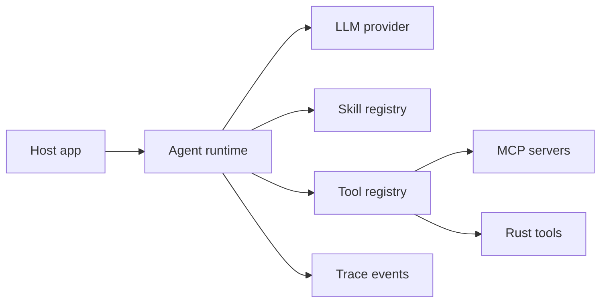

# Architecture

`sushi-agent` is split into a small TypeScript runtime and a Rust utility layer.

## Runtime Boundary

Applications own product state, auth, storage, and user experience. The kit owns the agent-facing contracts:

- `AgentRuntime` coordinates one run at a time.
- `ModelProvider` adapts any LLM or local model.
- `Skill` packages domain behavior behind a stable manifest.
- `ToolRegistry` exposes local, remote, and MCP tools.
- `TraceEvent` records what happened without requiring a hosted trace service.

## Data Flow

## Why Thin

The project avoids a full orchestration platform. Most production systems already have queues, databases, logging, auth, config, and deployment. A small agent kit should make those systems agent-capable without replacing them.

## Extension Points

- Add a provider by implementing `ModelProvider`.
- Add a skill with `defineSkill`.
- Add a tool with `defineTool`.
- Add an MCP server through `createMcpStdioClient`.
- Add a fast utility in `crates/sushi-tools` and expose it through a TypeScript tool adapter.
